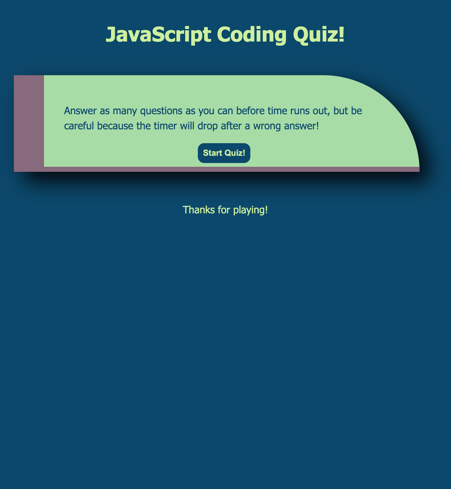
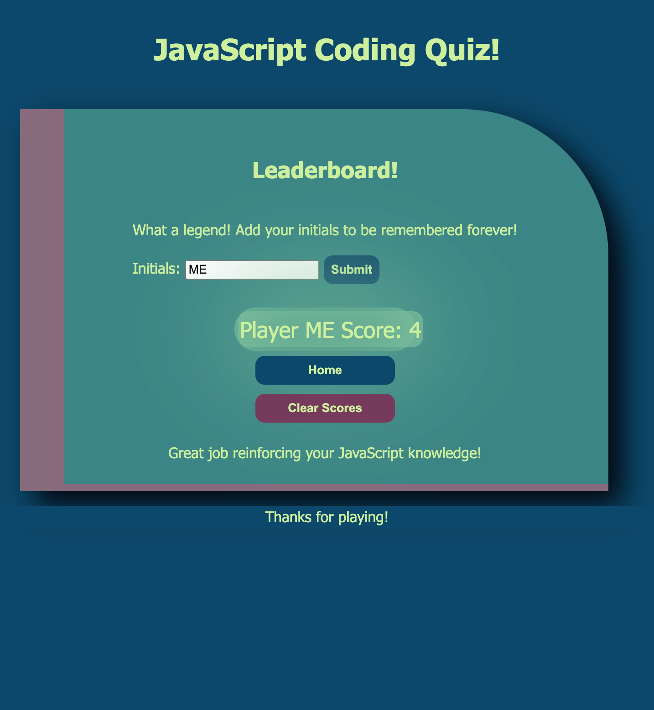

# multiple-choice-coding-quiz

## Description
 The motivation to building this online quiz was to provide a scaffold for future education-based web API projects. As an educator, I struggled to find resources that fit exactly the needs of my classroom, but in taking on this challenge, I will soon be able to build just the right classroom tools.

 I learned that JavaScript's ability to access a reference to HTML via the DOM is a fantastic resource for webpage interactivity. There are innumerable ways to design kinetically interactive pages, provided a little creativity.

## Installation
 N/A. [Deployed site here!](https://miacias.github.io/multiple-choice-coding-quiz/)
 

## Usage 

 1. Upon opening the site and reading the introduction, click Start.
 2. Race through as many questions as you can by clicking on the most appropriate response to answer each question while time counts down.
 3. When time has run out, the leaderboard page is presented. Enter initials in the form submission box and click Submit.
 4. Previous scores will appear on the leaderboard page after each submission.
 5. To play again, click Home. Alternatively, to erase the leaderboard and start fresh, click Clear Scores.
 

## Assets
The following image demonstrates the web application's appearance upon opening the site:

The following image demonstrates a sample question:

The following image demonstrates the post-quiz leaderboard:
 

## Roadmap

## Credits 

Documentation referenced:
- Mozilla Developer Network (HTML and CSS)
- Slack Overflow forums
- U. Penn Bootcamp study groups

Tutorials referenced:
- Catalin Pit, [Catalins.tech](https://catalins.tech/store-array-in-localstorage) - recap on local storage
- Coding Beauty, [PlainEnglish.io](https://plainenglish.io/blog/javascript-check-if-string-contains-only-letters-and-numbers-5dce23ddfecf) - RegExp for submitting initials

Artists:
- Skyblue2u, [ColourLovers.com](https://www.colourlovers.com/palette/580974/Adrift_in_Dreams) - color palette for all backgrounds and font colors
- leahdragon, [ColourLovers.com](https://www.colourlovers.com/palette/4889051/colorado) - color palette for select buttons
 

## License 
Please refer to the LICENSE in the repo.
 

--- 

 
 

🏆 The previous sections are the bare minimum, and your project will ultimately determine the content of this document. You might also want to consider adding the following sections. 

 
 

## Badges 

 
 

 

 
 

Badges aren't necessary, per se, but they demonstrate street cred. Badges let other developers know that you know what you're doing. Check out the badges hosted by [shields.io](https://shields.io/). You may not understand what they all represent now, but you will in time. 

 
 

## Features 

 
 

If your project has a lot of features, list them here. 

 
 

## How to Contribute 

 
 

If you created an application or package and would like other developers to contribute it, you can include guidelines for how to do so. The [Contributor Covenant](https://www.contributor-covenant.org/) is an industry standard, but you can always write your own if you'd prefer. 

 
 

## Tests 

 
 

Go the extra mile and write tests for your application. Then provide examples on how to run them here. 