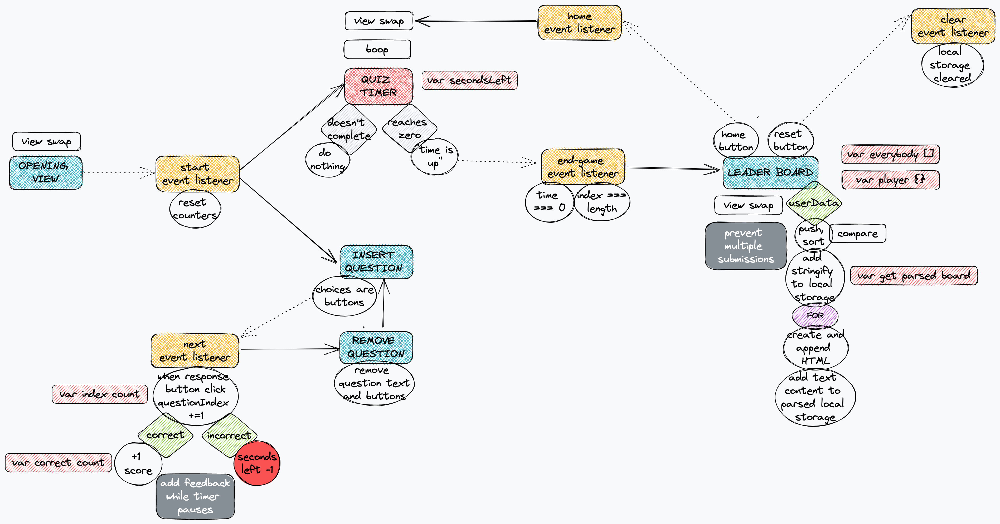

# multiple-choice-coding-quiz

## Description

 The motivation to building this online quiz was to provide a scaffold for future education-based web API projects. As an educator, I struggled to find resources that fit exactly the needs of my classroom, but in taking on this challenge, I will soon be able to build just the right classroom tools.

 I learned that JavaScript's ability to access a reference to HTML via the DOM is a fantastic resource for webpage interactivity. There are innumerable ways to design kinetically interactive pages, provided a little creativity.

## Installation

 N/A. [Deployed site here!](https://miacias.github.io/multiple-choice-coding-quiz/)
 

## Usage 

 1. Upon opening the site and reading the introduction, click Start.
 2. Race through as many questions as you can by clicking on the most appropriate response to answer each question while time counts down.
 3. When time has run out, the leaderboard page is presented. Enter initials in the form submission box and click Submit.
 4. Previous scores will appear on the leaderboard page after each submission.
 5. To play again, click Home. Alternatively, to erase the leaderboard and start fresh, click Clear Scores.
 
The following image demonstrates the web application's appearance upon opening the site:

The following image demonstrates a sample question:

The following image demonstrates the post-quiz leaderboard:

The following image demonstrates the last-saved Excalidraw planning stages:

## Features

- On-screen buttons and end-game conditions modify HTML visibility via web API (i.e. JavaScript access to the DOM)
- Counter records user's over-all score of total correct answers
- Timer limits maximum time available to play
- Supports fail cases such as if the user enters an empty string or non-alphabetic characters into the leaderboard

## Roadmap

 I am working through a series of weekly projects and hope to return to this one, though I may not have the time to come back to this project. Here are some of the desired features I would like to add in the future in no particular order:

- Upon clicking a quiz answer button, pausing the game timer briefly to provide the user with feedback (congratulations upon correct response and correction upon incorrect response). After the pause, resuming the game timer's countdown. [Possible resource.](https://stackoverflow.com/questions/3969475/javascript-pause-settimeout)
- Protection from a fail case that currently allows user to input initials multiple times after only playing the game once
- Visual animations between page view changes or question changes
- A randomizer function that presents questions in a different order each time the game is played. This function would contain or reference the question bank so that the questions are locally scoped instead of globally scoped. A variable currentQuestion would be able to handle each question. Correct responses would be removed from the questionBank pool via .splice, else incorrect responses would elicit no changes to the array of questions.
- A randomizer function that orders responses on-screen for the viewer each time a question is accessed.
- A counter that prints out the current number question to the HTML that counts ++ to show the user how many questions they have answered. (Care must be taken so the number question from its location in the array of questions is not shown. This counter must count on its own in the event that questions are presented randomly.)
- Bug fix: clicking in empty space near response buttons does not get accepted as an answer selection.

## Credits 

Documentation referenced:
- Mozilla Developer Network (HTML and CSS)
- Slack Overflow forums
- U. Penn Bootcamp study groups

Tutorials referenced:
- Catalin Pit, [Catalins.tech](https://catalins.tech/store-array-in-localstorage) - recap on local storage
- Coding Beauty, [PlainEnglish.io](https://plainenglish.io/blog/javascript-check-if-string-contains-only-letters-and-numbers-5dce23ddfecf) - RegExp for submitting initials

Artists:
- Skyblue2u, [ColourLovers.com](https://www.colourlovers.com/palette/580974/Adrift_in_Dreams) - color palette for all backgrounds and font colors
- leahdragon, [ColourLovers.com](https://www.colourlovers.com/palette/4889051/colorado) - color palette for select buttons
 

## License 

Please refer to the LICENSE in the repo.